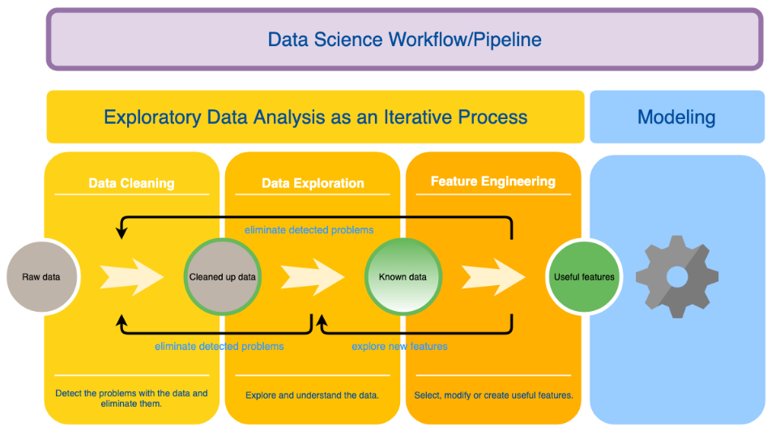

# Data Cleaning and EDA Assignments

In this repository, you will find a number of exercises I completed to deepen my understanding of data cleaning and exploratory data analysis. This is just one component of the Data Science workflow, explained below. 

1. Data cleaning: This is the first step of EDA. We take a raw dataset and eliminate problems which could prvent us from further analysis.
2. Data exploration: The second step is exploring the data to discover relationships and features. We will explore the data using both statistics and data visualization. If we identify new problems in the data during exploration, we will go back to the cleaning phase and eliminate these identified problems.
3. Feature engineering: The final step of EDA is the feature engineering, where we select the most useful features or create new features from the existing ones. This phase leads us to the next phases of the data-science pipeline. However, if we detect some problems with the data in this phase, we return to the data-cleaning step. Moreover, if we transform existing features or create new ones, we will need to go back to the data-exploration phase to investigate them.
